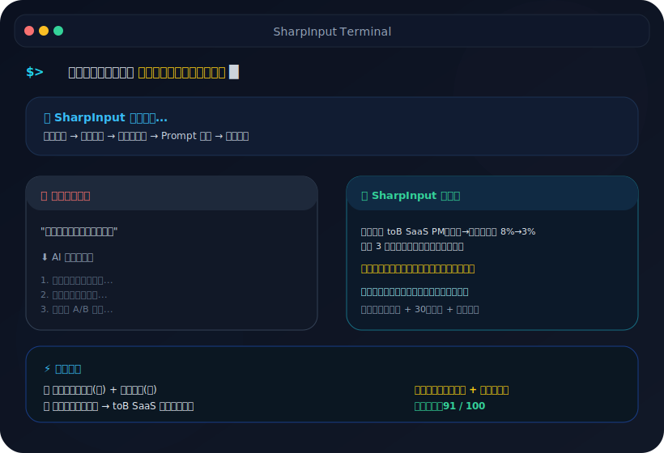

# ⚡ SharpInput v3.2

<p align="center">
  <strong>AI Input Compiler — 把模糊输入编译成可直接复制的高质量 Prompt</strong>
</p>

<p align="center">
  <a href="https://github.com/gaoyechen/SharpInput/stargazers"></a>
  <a href="https://github.com/gaoyechen/SharpInput/network/members"></a>
  <a href="https://github.com/gaoyechen/SharpInput/issues"></a>
  <a href="https://github.com/gaoyechen/SharpInput/blob/main/LICENSE"></a>
  
  
</p>

> 你花了几百块订阅 AI，却还在用搜索引擎级别的提问方式。

SharpInput 是一个 **Hermes Agent skill**：它不直接替你回答问题，而是先把你的模糊输入、提问、想法、方案或需求，编译成一个更清楚、更有约束、更不容易得到废话回答的 Prompt。

---

## 30 秒看懂

你原来这样问：

> 我们的转化率一直在下降，怎么办？

SharpInput 会把它升级成：

> 我们是 toB SaaS，注册→付费转化率从 8% 降到 3%，持续 3 个月。流量来源没有明显变化，产品近三个月没有大改。请你先判断问题更可能出在产品、市场还是销售，并必须选边站。给出一个大多数人不会先想到的根因假设，并设计一个 30 天内可验证的小实验。最后说明：如果按你的诊断执行，三个月后最可能后悔什么？

差别不是“文案更漂亮”，而是：**目标、背景、约束、判断标准、输出格式和压力测试都被补齐了。**

<p align="center">
  
</p>

---

## 适合谁

- 经常觉得 AI 回答“看似全面，其实没用”的人
- 产品经理、开发者、创业者、内容创作者
- 想让 AI 给出判断、方案、分析、评审，而不是安全废话的人
- Hermes Agent 用户，或正在组织个人 AI Agent skill 工作流的人

不适合：

- 你想让 AI 直接执行任务，而不是优化输入
- 你只需要事实查询、代码执行、文件修改
- 你不想补任何上下文，只想让 AI 猜你的意图

---

## 安装

详细安装见 [INSTALL.md](INSTALL.md)。

### Hermes Agent 快速安装

```bash
git clone https://github.com/gaoyechen/SharpInput.git
mkdir -p "$LOCALAPPDATA/hermes/skills/sharpinput"
cp -R SharpInput/* "$LOCALAPPDATA/hermes/skills/sharpinput/"
```

然后在 Hermes 中运行：

```text
/reload-skills
```

装完对 Agent 说：

```text
帮我优化：我想让 AI 帮我做一件什么事，应该怎么提问？
```

SharpInput 会自动接管，识别意图、检测场景、补全上下文，输出一个可直接复制的升级版 Prompt。

验证：

```bash
hermes chat --skills sharpinput -q "帮我优化：为什么我的 GitHub skill 没有 star？" -Q
```

> Windows 用户：`$LOCALAPPDATA/hermes/skills/sharpinput` 通常对应 `C:\Users\<用户名>\AppData\Local\hermes\skills\sharpinput`。

---

## 用法

说这些话时，SharpInput 应该接管：

```text
帮我优化这个问题
这样问 AI 行不行？
帮我润色一下这个 prompt
帮我理清这个需求，变成好问题
我想让 AI 帮我做 X，应该怎么提问？
```

控制深度：

```text
简单优化   → Level 1，轻度改写，少问问题
施压一下   → Level 2，增加约束、判断标准、反废话机制
深度模式   → Level 3，适合高风险决策、方案评审、多路径比较
```

---

## 真实运行示例

命令：

```bash
hermes chat --skills sharpinput -q "帮我优化：为什么我的 GitHub skill 没有 star？请输出一个可以直接复制给 AI 的提问。" -Q
```

输出节选：

```text
[SharpInput 识别结果]
Level: 2
主意图: 让 AI 帮你诊断一个 GitHub 项目/skill 没有 star 的原因
场景: GitHub 项目增长/传播/定位分析
上下文状态: 缺 repo 链接、目标用户、README、发布渠道，所以用占位符保留

[升级版问题]
> 你是一名熟悉 GitHub 开源项目增长、开发者工具传播、AI Agent/Skill 生态的产品顾问。
>
> 请帮我严厉分析：为什么我这个 GitHub 上的 skill/项目没有 star？
> ...
> 不要默认“没人 star = 项目不好”，也不要默认“多宣传就行”。
```

这就是 SharpInput 的核心价值：**不是替你回答，而是先把“弱问题”变成一个值得被认真回答的问题。**

---

## 它怎么工作

```text
用户弱输入
  ↓
触发判断
  ↓
意图识别 → 场景检测 → 上下文补全
  ↓
Prompt 编译 → 默认答案压力测试 → 质量检查
  ↓
复制即用的升级版 Prompt
```

核心能力：

| 能力 | 作用 |
|---|---|
| 意图识别 | 判断用户到底是在求解释、决策、对比、规划、验证还是表达 |
| 场景检测 | 针对电脑选购、AI 订阅、PRD、UI 评审、学习备考等场景补关键槽位 |
| 上下文补全 | 只问真正影响输出质量的问题，避免泛泛追问“背景是什么” |
| Prompt 编译 | 把角色、目标、约束、判断标准、步骤和输出格式组织成可复制 Prompt |
| 默认答案压力测试 | 防止 AI 输出“看情况”“各有优劣”“建议综合考虑”式废话 |
| Judge 审查 | Level 3 下对高风险决策和方案评审做更严格的质量检查 |

---

## 安全边界

**SharpInput 不会做的事：**

- 不会直接回答你的底层任务（只输出升级版 prompt）
- 不会发送外部网络请求
- 不会在没有你确认时猜测场景特定事实（预算、受众、平台）
- 不会把你的偏好写入仓库或 skill 包内部（见 [PRIVACY.md](PRIVACY.md)）
- Level 3 Judge 审查会呈现多条路径，等你选择

**什么时候 SharpInput 会停下来问你：**

- 你的意图混合了"优化输入"和"直接回答"
- 关键上下文缺失（预算、受众、约束），用 placeholder 会影响质量
- 信心低于 0.65 时，会请你确认意图

---

## 项目结构

```text
SharpInput/
├── SKILL.md                         # Hermes skill 入口
├── AGENT.md                         # 编排流程和 handoff 规范
├── modules/                         # 内部能力模块，不会被 Hermes 识别成独立 skills
│   ├── intent-detection.md
│   ├── scenario-detection.md
│   ├── scenario-slot-elicitation.md
│   ├── context-completion.md
│   ├── description-clarifier.md
│   ├── prompt-compiler.md
│   ├── pressure-strategy.md
│   ├── judge-review.md
│   └── output-renderer.md
├── references/                      # taxonomy、rubric、模板和隐私安全的示例状态文件
├── examples/                        # 示例输入和预期路线
├── tests/                           # 回归用例和质量评分标准
├── scripts/                         # demo 录制脚本和验证工具
├── INSTALL.md                       # 安装、升级、卸载和排障
└── PRIVACY.md                       # 本地状态和隐私说明
```

设计原则：**Agent 管流程，modules 管能力。** 内部模块不再放在顶层 `skills/` 目录下，避免安装后污染用户的 Hermes skills 列表。

---

## 隐私和本地状态

SharpInput 不应该把真实用户偏好写进仓库或 skill 包内部。

仓库只提供：

```text
references/user-preferences.schema.json
references/user-preferences.example.json
```

真实偏好应存储在用户本地 profile 数据目录，例如：

```text
$HERMES_HOME/data/sharpinput/user-preferences.json
```

详细说明见 [PRIVACY.md](PRIVACY.md)。

---

## 回归检查

修改 `SKILL.md`、`AGENT.md`、`modules/` 或 `references/` 后，至少检查：

```text
tests/regression-cases.md
tests/quality-rubric.md
```

关键标准：

- 只在“优化输入/Prompt”场景触发
- 不直接回答底层任务
- 输出必须包含一个完整、可复制的升级版 Prompt
- Level 2+ 不应该跳过关键上下文
- 不应该强行反共识或过度施压

---

## Changelog

### v3.2

- Darwin 9 维评估优化（6.73 → 7.56，+0.83）
  - dim4 检查点：插入 3 个显性标记（混合意图/Level 3/质量门）
  - dim8 路由一致性：Level 2 上下文不足不再降级为 Clarify First
  - dim9 反例：新增 DON'T 节（10 条反例覆盖输出风格/格式/路由）
- Luban 鲁班打磨：结构清理 + showcase 升级
  - SKILL.md/AGENT.md 重叠率从 ~40% 降至 ~5%
  - modules/*.md frontmatter 修复（防止被识别为独立 skill）
  - README 增加安全边界、致谢、装完第一句话
  - 新增 scripts/ 目录（demo 录制脚本 + vhs tape）
- 新增 test-prompts.json（3 个典型测试场景）

### v3.1

- 将内部能力文件从 `skills/*/SKILL.md` 移到 `modules/*.md`，避免被 Hermes 识别成多个独立 skills
- 主 skill canonical name 改为 `sharpinput`
- 移除仓库中的真实 `user-preferences.json`，改为 schema/example
- 补充安装、隐私和真实运行说明
- README 中的版本、模块数和结构说明与实际仓库对齐

### v3.0

- 从单体 prompt 重构为 Agent + 模块化能力文件
- 新增意图识别、场景模板、上下文补全、压力策略、Judge 审查和回归用例

---

## 致谢

- **Prompt engineering best practices**：受 Anthropic、OpenAI 的 prompt 工程指南启发，但 SharpInput 的核心创新是"自动编译"而非"手动优化"
- **DSPy / PromptWizard**：自动 prompt 优化的研究方向提供了理论基础；SharpInput 选择了 agent-native 形态而非框架形态
- **prompt-optimizer**（30K⭐）：验证了"prompt 优化"品类的真实需求
- **Hermes Agent**：提供了 skill 系统、触发路由和 handoff 机制的运行时基础

---

## License

MIT —— 随便用，随便改。

---

**如果你受够了 AI 给你灌水，先别急着换模型，先把问题问锋利。**
